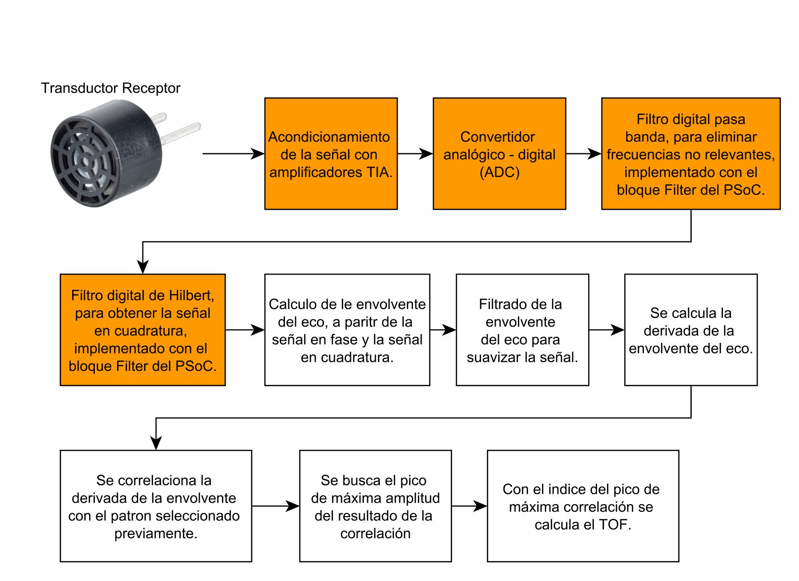
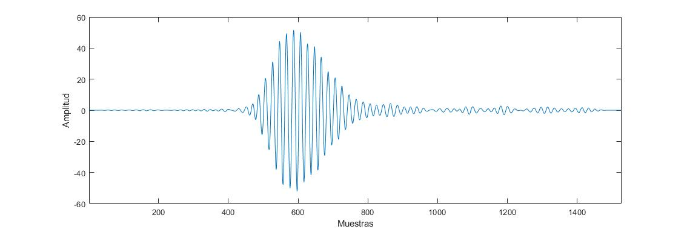
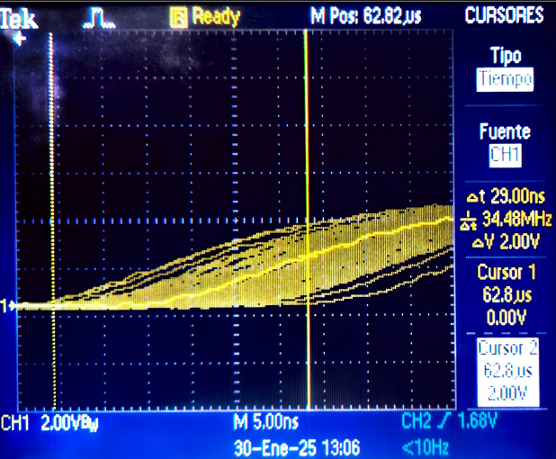
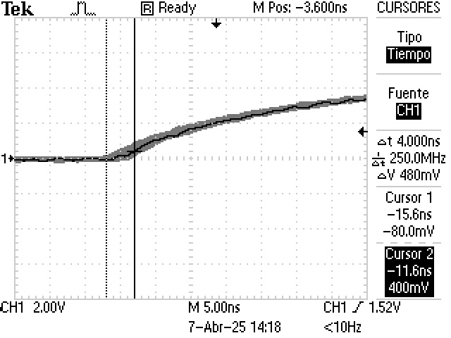
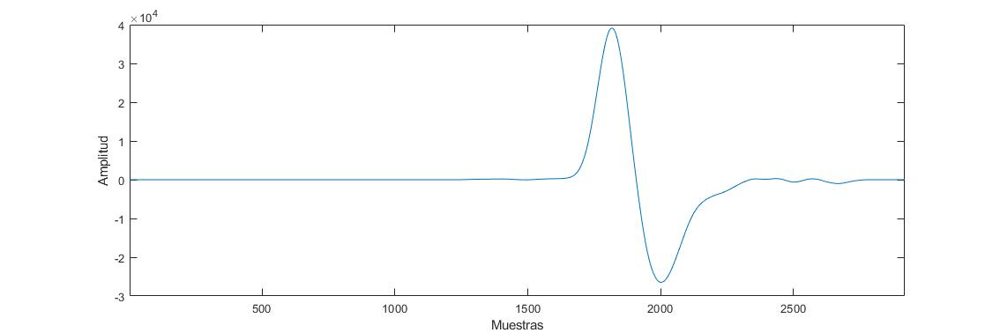

# Ultrasonic Time-of-Flight DSP — Real-Time Signal Detection in Noise

Real-time ultrasonic **time-of-flight (ToF)** measurement for a low-cost IoT flowmeter.
The system recovers a **known ultrasonic echo from noisy real-world signals** and
estimates its arrival time to **sub-sample precision**, running on embedded hardware
(**PSoC 5LP + ESP32**). This was my research and final-degree project in Electronic
Engineering; the platform was published at **IEEE CHILECON 2025**.

> The core problem — recovering a known signal from noisy recordings by
> cross-correlation, with careful handling of sampling and aliasing — is a general
> signal-detection problem, implemented here end to end from MATLAB analysis to
> real-time embedded C.



*Processing chain, from the receiver transducer to the time-of-flight estimate: analog
signal conditioning → ADC → bandpass filter → Hilbert/envelope → envelope derivative →
cross-correlation with a reference template → peak location → ToF.*

---

## The engineering challenge

The ultrasonic transducer resonates at **~1 MHz**, but the PSoC ADC samples at a
**maximum of 1 MS/s** — below the Nyquist rate (which would need ≥ 2 MS/s). The signal
therefore cannot be sampled conventionally. The system solves this with:

- **Bandpass sampling (undersampling) at 800 kS/s**, deliberately aliasing the ~1 MHz
  band down to baseband, then **reconstructing** the waveform by **interpolation +
  low-pass FIR filtering**.
- **Detection by cross-correlation of the derivative of the signal envelope**, with
  **sub-sample interpolation** of the correlation peak for fine time-delay estimation.
- Explicit study of the **real-world limitations** that only appear outside simulation:
  additive noise, aliasing, and **sampling-clock jitter** — which was characterised and
  **reduced from ~29 ns to ~4 ns** by improving the clock source.



*The ~1 MHz ultrasonic echo, recovered after bandpass sampling at 800 kS/s followed by
interpolation and low-pass FIR reconstruction.*

## Results

- **Flow-velocity resolution ≈ 0.1 m/s.**
- **Sampling-clock jitter reduced from ~29 ns to ~4 ns.**
- Systematic **comparison of five correlation-based detection algorithms** across SNR
  levels (5–35 dB, additive white Gaussian noise) to choose the most robust one.
- Full pipeline validated against a MATLAB reference model, then deployed to embedded C.
- Platform published: *A Reconfigurable Embedded Platform for Accurate Ultrasonic TOF
  Estimation*, **IEEE CHILECON 2025**.

**Sampling-clock jitter — before and after improving the clock source**
(oscilloscope, infinite-persistence capture of the ADC end-of-conversion signal):

| Internal clock — Δt ≈ 29 ns | External crystal — Δt ≈ 4 ns |
|:---:|:---:|
|  |  |

## Signal-processing pipeline

1. **Acquisition** — PSoC 5LP ADC + **DMA**, bandpass sampling at **800 kS/s**.
2. **Reconstruction** — interpolation (factor **M = 25**) + **low-pass FIR** (128 taps),
   running in real time on the ESP32 (ARM/ESP-DSP routines).
3. **Envelope + derivative** — envelope detection and its derivative to sharpen the echo.
4. **Detection** — **cross-correlation** against a reference template, with sub-sample
   peak interpolation → time-delay (ToF) estimate.
5. **Flow velocity** — upstream/downstream ToF difference → flow velocity, via a
   least-squares fit.



*Cross-correlation of the envelope derivative against the reference template; the sharp,
well-defined peak makes the time-of-flight estimate robust to noise.*

## Repository structure

```
ultrasonic-tof-dsp/
├── matlab/                 MATLAB reference model and analysis
│   ├── correlacion_derivada/   envelope-derivative correlation, interpolation, echo generation
│   └── psoc_med_dis/
│       ├── comp_SNR/           comparison of 5 detection algorithms vs SNR (white noise)
│       └── medidas_paper/      scripts that generate the IEEE-paper figures
├── firmware/
│   ├── esp32/              ESP-IDF (PlatformIO) — UART link + reconstruction FIR
│   └── psoc/               PSoC 5LP — ADC/DMA acquisition + CMSIS-DSP correlation
└── docs/                   thesis and publication references
```

## Tech stack

**MATLAB** · **C (real-time embedded)** · **ARM CMSIS-DSP** · **FreeRTOS / ESP-IDF** ·
**PSoC Creator** · ADC/DAC · **DMA** · UART.

## Notes

- The MATLAB scripts are the algorithm reference model; code comments are in Spanish.
- The scripts load measured datasets (`.mat`) captured from the hardware; those raw
  measurement files are not committed here to keep the repository lightweight, and can
  be provided on request.
- See [`firmware/psoc/README.md`](firmware/psoc/README.md) for how the PSoC project is
  organised and its CMSIS-DSP dependency.

## Author

**Federico D. Morán Fretes** — Electronic Engineer · Audio & Embedded DSP
[LinkedIn](https://www.linkedin.com/in/federico-mor%C3%A1n-a9b95a231/) ·
[GitHub](https://github.com/fedemoranf-alt)

## License

Released under the [MIT License](LICENSE).
